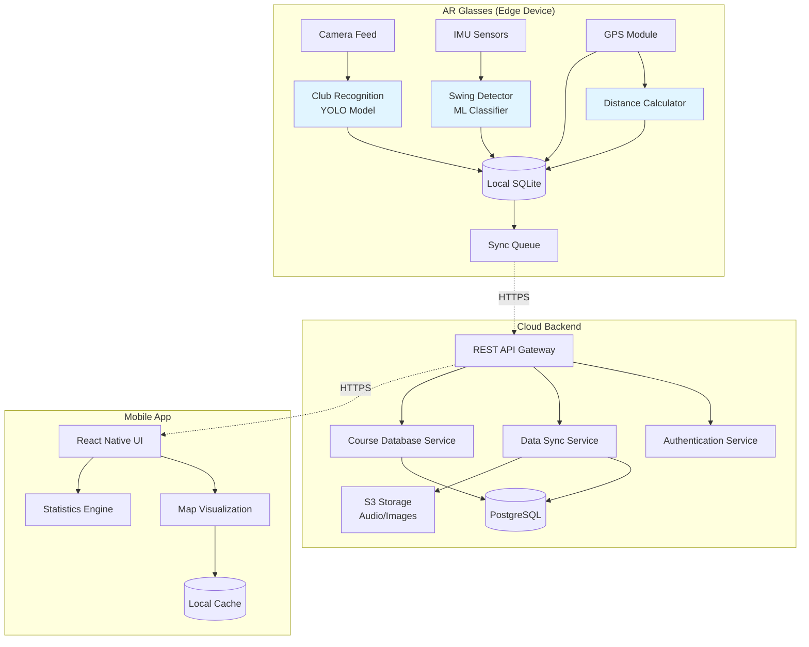
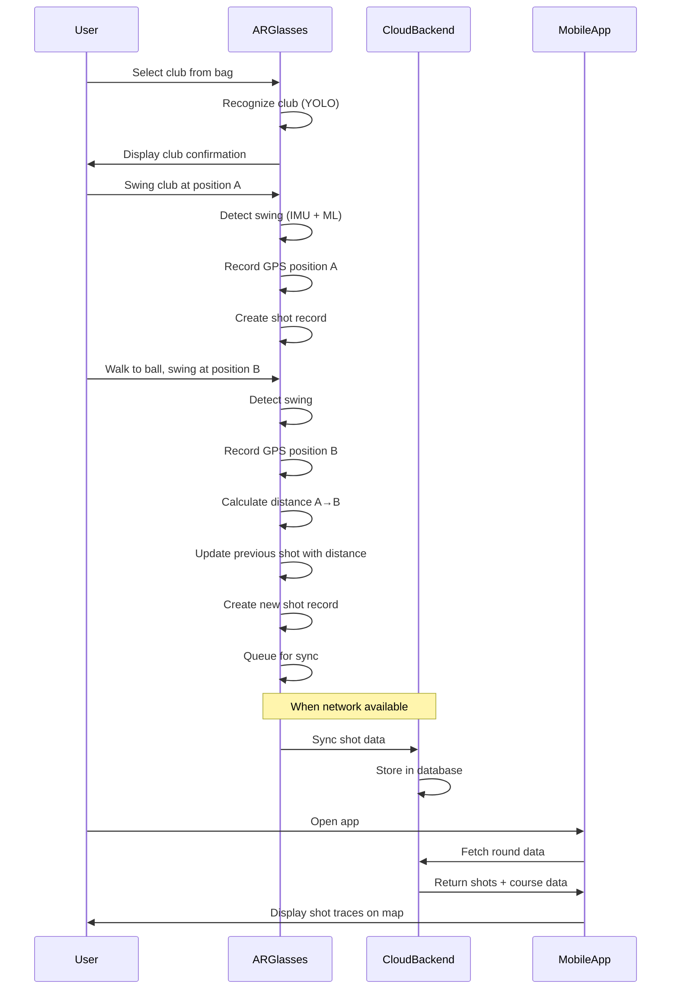

# Design Document: AR Golf Tracker

## Overview

The AR Golf Tracker is a distributed system consisting of three main components: an AR glasses application, a cloud backend service, and a mobile companion app. The system leverages computer vision, motion detection, and GPS tracking to automatically capture golf shot data during play, then synchronizes this data to the cloud for visualization and analysis on mobile devices. Shot distances are automatically calculated by measuring the GPS distance between consecutive shot positions.

The architecture follows a client-edge-cloud pattern where:
- **AR Glasses (Edge)**: Performs real-time processing for club recognition, swing detection, and GPS tracking with minimal latency
- **Cloud Backend**: Handles data synchronization, storage, course database management, distance calculations, and heavy processing tasks
- **Mobile App (Client)**: Provides post-round visualization, analysis, and user account management

This design prioritizes battery efficiency on the AR glasses, offline capability during rounds, and seamless data synchronization when connectivity is available. Shot distances are calculated automatically by measuring the GPS distance between consecutive shot positions on the same hole.

## Architecture

### System Architecture Diagram



### Component Interaction Flow



## Components and Interfaces

### 1. AR Glasses Application

**Platform**: Meta Ray-Ban Display or compatible AR glasses with Snapdragon AR1 Gen 1 processor

**Key Modules**:

#### 1.1 Club Recognition Module
- **Technology**: YOLOv8 or YOLOv11 object detection model
- **Input**: 12MP camera feed at 5 FPS (power-saving mode)
- **Output**: Club type classification with confidence score
- **Model**: Custom-trained on golf club dataset (14 club types)
- **Processing**: On-device inference using Snapdragon NPU
- **Latency Target**: < 2 seconds from club appearance to recognition

**Interface**:
```typescript
interface ClubRecognitionService {
  startRecognition(): void;
  stopRecognition(): void;
  onClubDetected(callback: (club: ClubType, confidence: number) => void): void;
  getCurrentClub(): ClubType | null;
}

enum ClubType {
  DRIVER, WOOD_3, WOOD_5,
  HYBRID_3, HYBRID_4, HYBRID_5,
  IRON_3, IRON_4, IRON_5, IRON_6, IRON_7, IRON_8, IRON_9,
  PITCHING_WEDGE, SAND_WEDGE, LOB_WEDGE,
  PUTTER
}
```

#### 1.2 Swing Detection Module
- **Technology**: ML classifier trained on IMU data (accelerometer + gyroscope)
- **Input**: 3-axis accelerometer and 3-axis gyroscope at 100 Hz
- **Output**: Swing event with timestamp and swing type (full swing vs practice)
- **Model**: Random Forest or LSTM classifier for swing phase segmentation
- **Features**: Peak acceleration, angular velocity, swing duration, impact detection
- **Latency Target**: < 500ms from impact to detection

**Interface**:
```typescript
interface SwingDetectionService {
  startMonitoring(): void;
  stopMonitoring(): void;
  onSwingDetected(callback: (swing: SwingEvent) => void): void;
  calibrate(userProfile: UserProfile): void;
}

interface SwingEvent {
  timestamp: number;
  swingType: 'FULL_SWING' | 'PRACTICE_SWING';
  peakAcceleration: number;
  swingDuration: number;
  confidence: number;
}
```

#### 1.3 Distance Calculation Module
- **Technology**: Haversine formula for GPS distance calculation
- **Input**: Two consecutive GPS positions on the same hole
- **Output**: Distance in yards or meters
- **Processing**: 
  - Calculate great-circle distance between positions
  - Account for elevation changes if altitude data available
  - Apply course-specific corrections (e.g., slope adjustments)
- **Trigger**: Automatically when new shot detected on same hole

**Interface**:
```typescript
interface DistanceCalculationService {
  calculateDistance(from: GPSPosition, to: GPSPosition): Distance;
  updatePreviousShot(shotId: string, distance: Distance): void;
  getLastShotPosition(holeNumber: number): GPSPosition | null;
}

interface Distance {
  value: number;
  unit: 'YARDS' | 'METERS';
  accuracy: 'HIGH' | 'MEDIUM' | 'LOW'; // based on GPS accuracy
}
```

#### 1.4 GPS Tracking Module
- **Technology**: Built-in GPS with GNSS support
- **Input**: GPS satellite signals
- **Output**: Latitude/longitude coordinates with accuracy estimate
- **Update Frequency**: 1 Hz (every second) during active round
- **Power Management**: Adaptive sampling based on movement detection

**Interface**:
```typescript
interface GPSTrackingService {
  startTracking(): void;
  stopTracking(): void;
  getCurrentPosition(): Promise<GPSPosition>;
  onPositionUpdate(callback: (position: GPSPosition) => void): void;
}

interface GPSPosition {
  latitude: number;
  longitude: number;
  accuracy: number; // meters
  timestamp: number;
  altitude?: number;
}
```

#### 1.5 Local Data Storage
- **Technology**: SQLite database
- **Purpose**: Offline storage of shot records during round
- **Schema**:

```sql
CREATE TABLE rounds (
  id TEXT PRIMARY KEY,
  course_id TEXT,
  start_time INTEGER,
  end_time INTEGER,
  sync_status TEXT -- 'PENDING', 'SYNCED', 'FAILED'
);

CREATE TABLE shots (
  id TEXT PRIMARY KEY,
  round_id TEXT,
  hole_number INTEGER,
  swing_number INTEGER,
  club_type TEXT,
  timestamp INTEGER,
  gps_lat REAL,
  gps_lon REAL,
  gps_accuracy REAL,
  distance_yards REAL,
  distance_accuracy TEXT, -- 'HIGH', 'MEDIUM', 'LOW'
  notes TEXT,
  sync_status TEXT,
  FOREIGN KEY (round_id) REFERENCES rounds(id)
);

CREATE TABLE sync_queue (
  id TEXT PRIMARY KEY,
  entity_type TEXT, -- 'ROUND', 'SHOT'
  entity_id TEXT,
  operation TEXT, -- 'CREATE', 'UPDATE', 'DELETE'
  payload TEXT, -- JSON
  retry_count INTEGER,
  created_at INTEGER
);
```

### 2. Cloud Backend Service

**Platform**: AWS (Lambda + API Gateway + RDS + S3)

**Key Services**:

#### 2.1 REST API Gateway
- **Technology**: AWS API Gateway + Lambda functions
- **Authentication**: JWT tokens with OAuth 2.0
- **Rate Limiting**: 100 requests/minute per user
- **Endpoints**:

```typescript
// Authentication
POST /api/v1/auth/register
POST /api/v1/auth/login
POST /api/v1/auth/refresh

// Sync endpoints
POST /api/v1/sync/rounds
POST /api/v1/sync/shots
GET /api/v1/sync/status

// Course data
GET /api/v1/courses/search?lat={lat}&lon={lon}&radius={meters}
GET /api/v1/courses/{courseId}
GET /api/v1/courses/{courseId}/holes

// Round data
GET /api/v1/rounds
GET /api/v1/rounds/{roundId}
GET /api/v1/rounds/{roundId}/shots
DELETE /api/v1/rounds/{roundId}

// Statistics
GET /api/v1/stats/summary
GET /api/v1/stats/by-club
GET /api/v1/stats/by-hole
```

#### 2.2 Data Sync Service
- **Technology**: AWS Lambda with SQS for async processing
- **Conflict Resolution**: Last-write-wins based on timestamp
- **Batch Processing**: Supports bulk shot uploads
- **Retry Logic**: Exponential backoff with max 5 retries

**Interface**:
```typescript
interface SyncService {
  syncRounds(rounds: Round[]): Promise<SyncResult>;
  syncShots(shots: Shot[]): Promise<SyncResult>;
  resolveConflicts(conflicts: Conflict[]): Promise<Resolution[]>;
}

interface SyncResult {
  success: boolean;
  syncedCount: number;
  failedCount: number;
  conflicts: Conflict[];
}
```

#### 2.3 Course Database Service
- **Technology**: PostgreSQL with PostGIS extension
- **Data Source**: Golf course database (licensed or scraped)
- **Coverage**: 1000+ courses with hole layouts
- **Spatial Queries**: Find courses within radius, identify current hole

**Schema**:
```sql
CREATE TABLE courses (
  id UUID PRIMARY KEY,
  name TEXT NOT NULL,
  location GEOGRAPHY(POINT),
  address TEXT,
  total_holes INTEGER,
  par INTEGER,
  yardage INTEGER,
  rating REAL,
  slope INTEGER
);

CREATE TABLE holes (
  id UUID PRIMARY KEY,
  course_id UUID REFERENCES courses(id),
  hole_number INTEGER,
  par INTEGER,
  yardage INTEGER,
  tee_box_location GEOGRAPHY(POINT),
  green_location GEOGRAPHY(POINT),
  fairway_polygon GEOGRAPHY(POLYGON),
  hazards JSONB -- array of hazard polygons
);

CREATE INDEX idx_courses_location ON courses USING GIST(location);
CREATE INDEX idx_holes_tee_location ON holes USING GIST(tee_box_location);
```

#### 2.4 User Data Storage
- **Technology**: PostgreSQL for structured data, S3 for audio files
- **Encryption**: AES-256 at rest, TLS 1.3 in transit
- **Retention**: Configurable per user (default 2 years)

**Schema**:
```sql
CREATE TABLE users (
  id UUID PRIMARY KEY,
  email TEXT UNIQUE NOT NULL,
  password_hash TEXT NOT NULL,
  created_at TIMESTAMP,
  preferences JSONB
);

CREATE TABLE user_rounds (
  id UUID PRIMARY KEY,
  user_id UUID REFERENCES users(id),
  course_id UUID REFERENCES courses(id),
  start_time TIMESTAMP,
  end_time TIMESTAMP,
  weather_conditions JSONB,
  created_at TIMESTAMP
);

CREATE TABLE user_shots (
  id UUID PRIMARY KEY,
  round_id UUID REFERENCES user_rounds(id),
  hole_number INTEGER,
  swing_number INTEGER,
  club_type TEXT,
  shot_time TIMESTAMP,
  gps_origin GEOGRAPHY(POINT),
  distance_yards REAL,
  distance_accuracy TEXT,
  notes TEXT
);
```

### 3. Mobile Application

**Platform**: React Native (iOS and Android)

**Key Modules**:

#### 3.1 Map Visualization
- **Technology**: Mapbox GL or Google Maps SDK
- **Features**:
  - Course overlay with hole boundaries
  - Shot markers with club icons
  - Shot trace lines (estimated ball flight)
  - Heat maps for shot dispersion
  - 3D terrain view

**Interface**:
```typescript
interface MapVisualizationService {
  loadCourse(courseId: string): Promise<void>;
  displayRound(roundId: string): Promise<void>;
  filterShots(filter: ShotFilter): void;
  zoomToHole(holeNumber: number): void;
  exportMap(format: 'PNG' | 'PDF'): Promise<Blob>;
}

interface ShotFilter {
  holeNumbers?: number[];
  clubTypes?: ClubType[];
  distanceRange?: { min: number; max: number };
}
```

#### 3.2 Statistics Engine
- **Technology**: TypeScript with Chart.js for visualization
- **Metrics**:
  - Average distance per club
  - Fairways hit percentage
  - Greens in regulation
  - Putts per hole
  - Shot dispersion patterns
  - Performance trends over time

**Interface**:
```typescript
interface StatisticsEngine {
  calculateClubAverages(rounds: Round[]): ClubStatistics[];
  calculateScoring(rounds: Round[]): ScoringStatistics;
  calculateTrends(rounds: Round[], metric: string): TrendData;
  compareRounds(roundId1: string, roundId2: string): Comparison;
}

interface ClubStatistics {
  clubType: ClubType;
  averageDistance: number;
  standardDeviation: number;
  totalShots: number;
  accuracy: number; // percentage
}
```

#### 3.3 Offline Cache
- **Technology**: AsyncStorage (React Native) or SQLite
- **Purpose**: Cache recent rounds for offline viewing
- **Size Limit**: 100 MB per user

## Data Models

### Core Data Structures

```typescript
interface Round {
  id: string;
  userId: string;
  courseId: string;
  courseName: string;
  startTime: number; // Unix timestamp
  endTime?: number;
  shots: Shot[];
  weather?: WeatherConditions;
  syncStatus: 'PENDING' | 'SYNCED' | 'FAILED';
}

interface Shot {
  id: string;
  roundId: string;
  holeNumber: number;
  swingNumber: number;
  clubType: ClubType;
  timestamp: number;
  gpsOrigin: GPSPosition;
  distance?: {
    value: number;
    unit: 'YARDS' | 'METERS';
    accuracy: 'HIGH' | 'MEDIUM' | 'LOW';
  };
  notes?: string;
  syncStatus: 'PENDING' | 'SYNCED' | 'FAILED';
}

interface Course {
  id: string;
  name: string;
  location: {
    latitude: number;
    longitude: number;
  };
  address: string;
  totalHoles: number;
  par: number;
  yardage: number;
  holes: Hole[];
}

interface Hole {
  id: string;
  courseId: string;
  holeNumber: number;
  par: number;
  yardage: number;
  teeBoxLocation: GPSPosition;
  greenLocation: GPSPosition;
  fairwayPolygon?: GeoPolygon;
  hazards?: Hazard[];
}

interface Hazard {
  type: 'WATER' | 'BUNKER' | 'TREES' | 'OUT_OF_BOUNDS';
  polygon: GeoPolygon;
}

interface GeoPolygon {
  coordinates: Array<[number, number]>; // [longitude, latitude]
}

interface UserProfile {
  id: string;
  email: string;
  preferences: {
    distanceUnit: 'YARDS' | 'METERS';
    autoSync: boolean;
    dataRetentionDays: number;
  };
  calibration?: {
    clubRecognitionModel: string; // S3 key
    swingProfile: SwingProfile;
  };
}

interface SwingProfile {
  averageSwingSpeed: number;
  swingTempo: number;
  dominantHand: 'LEFT' | 'RIGHT';
}
```

## Correctness Properties

*A property is a characteristic or behavior that should hold true across all valid executions of a system—essentially, a formal statement about what the system should do. Properties serve as the bridge between human-readable specifications and machine-verifiable correctness guarantees.*

### Property 1: Club Recognition Accuracy
*For any* golf club held in the camera's field of view with adequate lighting, the Club Recognition System should identify the club type with at least 85% confidence within 2 seconds, or indicate low confidence and prompt for user confirmation.

**Validates: Requirements 1.1, 1.4**

### Property 2: Swing Detection Completeness
*For any* full golf swing performed with a recognized club, the Swing Detector should create exactly one Shot Record with the correct hole number, swing sequence number, and club type within 500 milliseconds of impact.

**Validates: Requirements 2.1, 2.2, 2.5**

### Property 3: Practice Swing Filtering
*For any* practice swing (swing without ball contact), the Swing Detector should not create a Shot Record, ensuring only actual shots are tracked.

**Validates: Requirements 2.3**

### Property 4: Distance Calculation from GPS
*For any* two consecutive shots on the same hole with valid GPS coordinates, the Distance Calculation Service should compute the distance between them using the Haversine formula and update the first shot's distance field with accuracy within 5% of the true distance.

**Validates: Requirements 3.2, 4.1**

### Property 5: GPS Position Recording
*For any* detected shot, the GPS Tracker should capture and store the user's GPS coordinates with the Shot Record, including an accuracy estimate, ensuring every shot has location data (even if marked as low accuracy).

**Validates: Requirements 4.1, 4.2**

### Property 6: Hole Transition Detection
*For any* movement from one hole's tee box to another hole's tee box (based on GPS proximity within 20 meters), the Course Map System should automatically increment the hole number in subsequent Shot Records.

**Validates: Requirements 5.3**

### Property 7: Data Sync Idempotency
*For any* shot or round data synced multiple times to the cloud, the Data Sync Service should produce the same final state as syncing once, preventing duplicate records or data corruption.

**Validates: Requirements 7.1, 7.2**

### Property 8: Sync Conflict Resolution
*For any* shot record modified on both the AR glasses and cloud backend, the Data Sync Service should resolve the conflict by preserving the version with the most recent timestamp, ensuring no data loss.

**Validates: Requirements 7.6**

### Property 9: Shot Trace Visualization Completeness

**Validates: Requirements 7.6**

### Property 9: Shot Trace Visualization Completeness
*For any* shot with valid GPS origin coordinates, the Mobile App should display a shot marker on the course map at the correct location, ensuring all shots are visualized.

**Validates: Requirements 6.3**

### Property 10: Statistics Calculation Accuracy
*For any* set of shots grouped by club type, the Statistics Engine should calculate the average distance as the arithmetic mean of all shot distances for that club, with a maximum error of 0.1 yards.

**Validates: Requirements 6.6**

### Property 12: Data Deletion Completeness
*For any* user-initiated deletion of a shot or round, the System should remove all associated data (shot records, audio files, GPS data) from all devices and cloud storage within 24 hours, ensuring complete data removal.

**Validates: Requirements 9.4**

### Property 13: Battery Life Guarantee
*For any* continuous 5-hour usage period with all tracking features enabled, the AR Glasses should maintain sufficient battery to record shots, with battery level never dropping below 5% before the 5-hour mark.

**Validates: Requirements 8.1**

### Property 14: Offline Operation Continuity
*For any* period without network connectivity, the AR Glasses should continue recording shots to local storage, and upon connectivity restoration, should sync all queued data without loss.

**Validates: Requirements 7.2**

### Property 15: Course Identification Accuracy
*For any* GPS position within 100 meters of a known golf course, the Course Map System should correctly identify the course and load the appropriate course layout within 5 seconds.

**Validates: Requirements 5.1, 5.2**

## Error Handling

### AR Glasses Error Scenarios

1. **Club Recognition Failure**
   - **Cause**: Poor lighting, club obscured, unknown club type
   - **Handling**: Display low confidence warning, allow manual club selection via gesture or mobile app
   - **Recovery**: Continue monitoring for better view

2. **Swing Detection False Positive**
   - **Cause**: Sudden movement, practice swing misclassified
   - **Handling**: Allow user to delete last shot via gesture or mobile app
   - **Recovery**: Adjust ML model threshold based on user feedback

3. **GPS Signal Loss**
   - **Cause**: Tree cover, tunnel, poor satellite visibility
   - **Handling**: Mark shot with "low accuracy" flag, estimate position based on last known location + movement
   - **Recovery**: Update position when GPS signal restored

4. **Distance Calculation Inaccuracy**
   - **Cause**: GPS drift, poor accuracy on consecutive shots
   - **Handling**: Mark distance with "low accuracy" flag, allow manual correction in mobile app
   - **Recovery**: Use higher-accuracy GPS readings when available

5. **Battery Critical**
   - **Cause**: Extended use, cold weather
   - **Handling**: Enter power-saving mode (disable camera, reduce GPS frequency), notify user
   - **Recovery**: Maintain core shot recording until shutdown

### Cloud Backend Error Scenarios

1. **Sync Conflict**
   - **Cause**: Same shot modified on device and cloud
   - **Handling**: Use last-write-wins based on timestamp, log conflict for user review
   - **Recovery**: Allow user to manually resolve in mobile app

2. **Database Connection Failure**
   - **Cause**: Network outage, database maintenance
   - **Handling**: Return 503 Service Unavailable, client retries with exponential backoff
   - **Recovery**: Queue requests in SQS for processing when database available

3. **Course Not Found**
   - **Cause**: Playing at unlisted course
   - **Handling**: Operate in generic mode without hole-specific data, allow user to submit course for addition
   - **Recovery**: Manual course addition by admin team

4. **Authentication Failure**
   - **Cause**: Expired token, invalid credentials
   - **Handling**: Return 401 Unauthorized, client refreshes token or prompts re-login
   - **Recovery**: Automatic token refresh on mobile app

### Mobile App Error Scenarios

1. **Map Loading Failure**
   - **Cause**: Network timeout, invalid course data
   - **Handling**: Display cached map if available, show error message with retry option
   - **Recovery**: Retry with exponential backoff

2. **Statistics Calculation Error**
   - **Cause**: Missing data, invalid shot records
   - **Handling**: Skip invalid records, display warning about incomplete data
   - **Recovery**: Attempt to fetch missing data from cloud

3. **Offline Mode**
   - **Cause**: No network connectivity
   - **Handling**: Display cached rounds, disable sync-dependent features, show offline indicator
   - **Recovery**: Auto-sync when connectivity restored

## Testing Strategy

### Unit Testing
- **Framework**: Jest (TypeScript/JavaScript), pytest (Python backend)
- **Coverage Target**: 80% code coverage
- **Focus Areas**:
  - Data model validation and serialization
  - API endpoint request/response handling
  - GPS coordinate calculations
  - Statistics computation functions
  - Error handling edge cases

### Property-Based Testing
- **Framework**: fast-check (TypeScript), Hypothesis (Python)
- **Configuration**: Minimum 100 iterations per property test
- **Test Tagging**: Each test references its design property

**Example Property Tests**:

```typescript
// Property 4: Distance Calculation from GPS
describe('Distance Calculation Service', () => {
  it('should calculate distance within 5% accuracy using Haversine formula', () => {
    fc.assert(
      fc.property(
        generateGPSPosition(),
        generateGPSPosition(),
        (pos1, pos2) => {
          const calculatedDistance = calculateDistance(pos1, pos2);
          const expectedDistance = haversineDistance(pos1, pos2);
          
          const errorPercent = Math.abs(calculatedDistance.value - expectedDistance) / expectedDistance;
          expect(errorPercent).toBeLessThan(0.05); // 5% accuracy
        }
      ),
      { numRuns: 100 }
    );
  });
  // Feature: ar-golf-tracker, Property 4: Distance Calculation from GPS
});

// Property 7: Data Sync Idempotency
describe('Data Sync Service', () => {
  it('should produce same result when syncing data multiple times', () => {
    fc.assert(
      fc.property(
        fc.array(generateShot(), { minLength: 1, maxLength: 10 }),
        async (shots) => {
          // Sync once
          await syncService.syncShots(shots);
          const result1 = await fetchShotsFromDB(shots[0].roundId);
          
          // Sync again with same data
          await syncService.syncShots(shots);
          const result2 = await fetchShotsFromDB(shots[0].roundId);
          
          expect(result1).toEqual(result2);
          expect(result1.length).toBe(shots.length);
        }
      ),
      { numRuns: 100 }
    );
  });
  // Feature: ar-golf-tracker, Property 7: Data Sync Idempotency
});

// Property 10: Statistics Calculation Accuracy
describe('Statistics Engine', () => {
  it('should calculate average distance with max 0.1 yard error', () => {
    fc.assert(
      fc.property(
        fc.array(
          fc.record({
            clubType: fc.constantFrom(...Object.values(ClubType)),
            distance: fc.float({ min: 50, max: 350, noNaN: true })
          }),
          { minLength: 1, maxLength: 50 }
        ),
        (shots) => {
          const stats = calculateClubAverages(shots);
          
          // Group shots by club
          const byClub = shots.reduce((acc, shot) => {
            if (!acc[shot.clubType]) acc[shot.clubType] = [];
            acc[shot.clubType].push(shot.distance);
            return acc;
          }, {});
          
          // Verify each club's average
          stats.forEach(stat => {
            const distances = byClub[stat.clubType];
            const expectedAvg = distances.reduce((a, b) => a + b) / distances.length;
            expect(Math.abs(stat.averageDistance - expectedAvg)).toBeLessThan(0.1);
          });
        }
      ),
      { numRuns: 100 }
    );
  });
  // Feature: ar-golf-tracker, Property 10: Statistics Calculation Accuracy
});
```

### Integration Testing
- **Scope**: End-to-end flows across components
- **Test Scenarios**:
  - Complete round recording flow (club selection → swing → distance calculation → sync)
  - Offline mode → online sync flow
  - Course identification and hole transition
  - Mobile app data visualization
- **Tools**: Cypress (mobile app), Postman (API), custom AR glasses simulator

### Performance Testing
- **Metrics**:
  - Club recognition latency (target: < 2s)
  - Swing detection latency (target: < 500ms)
  - API response time (target: < 200ms p95)
  - Battery consumption (target: 5+ hours)
- **Tools**: JMeter (API load testing), custom battery profiling scripts

### User Acceptance Testing
- **Participants**: 10-20 golfers of varying skill levels
- **Test Courses**: 3-5 different courses with varying terrain
- **Metrics**:
  - Club recognition accuracy in real conditions
  - Swing detection false positive/negative rates
  - Distance calculation accuracy compared to rangefinder
  - User satisfaction scores
  - Battery life in real rounds

### Security Testing
- **Focus Areas**:
  - Authentication and authorization
  - Data encryption (at rest and in transit)
  - API rate limiting and DDoS protection
  - SQL injection and XSS prevention
- **Tools**: OWASP ZAP, Burp Suite, AWS Security Hub
